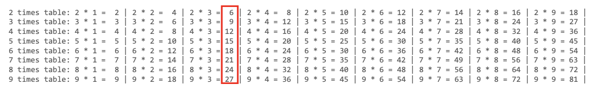
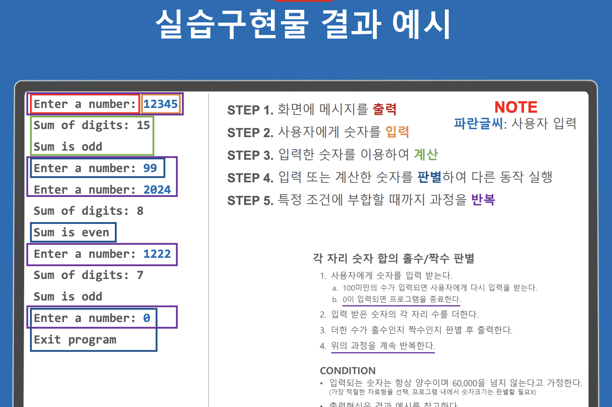

# 실습1
## 구구단 출력

아래와 같이 구구단을 출력하는 프로그램을 작성

### CONDITION
• 계산결과 값은 항상 2자리를 차지한다.
ex) 빨간네모에서 6과 12 모두 2자리를 차지

# 실습2
## 각 자리 숫자 합의 홀수/짝수 판별

1. 사용자에게 숫자를 입력 받는다.
    a. 100미만의 수가 입력되면 사용자에게 다시 입력을 받는다.
    b. 0이 입력되면 프로그램을 종료한다.
2. 입력 받은 숫자의 각 자리 수를 더한다.
3. 더한 수가 홀수인지 짝수인지 판별 후 출력한다.
4. 위의 과정을 계속 반복한다.

### CONDITION
- 입력되는 숫자는 항상 양수이며 60,000을 넘지 않는다고 가정한다.
(가장 적절한 자료형을 선택, 프로그램 내에서 숫자크기는 판별할 필요X)
- 출력형식은 결과 예시를 참고한다.

